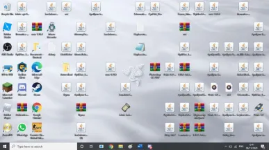
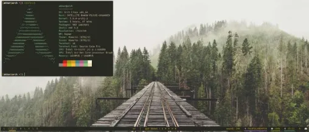
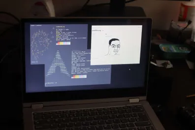

# Desktops

When I first saw this Linux 'rice' my jaw was on the floor - I thought this was beautiful. I was naive, this looks impressive to people who have never actually customised an operating system. But in reality this is not a practical desktop.

This was the desktop of a friend from secondary very messy.

This is the old 'bspwm' desktop of a friend.

