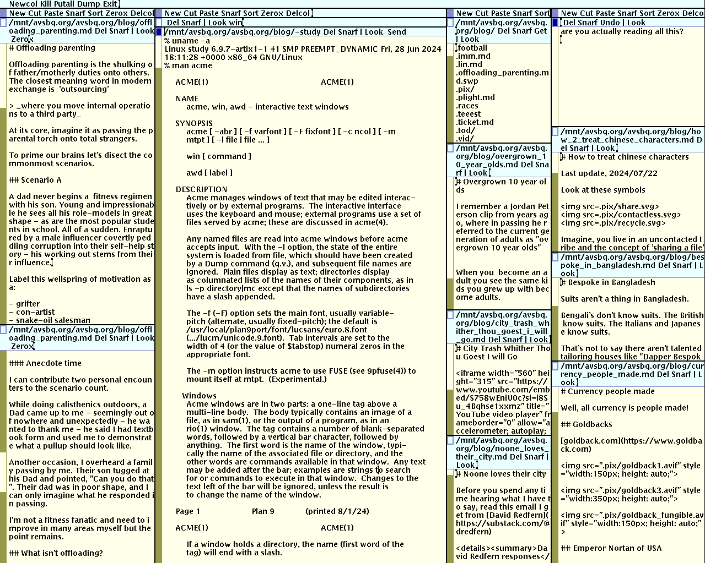

# Why Acme

Acme is perfect with working with dozens of files

	
## Zerox

Create a copy of the window containing most recently
selected text

## But isn't the mouse slower and for n00bs?

[Read this](https://www.asktog.com/TOI/toi06KeyboardVMouse1.html)

[And this](https://www.asktog.com/TOI/toi22KeyboardVMouse2.html)

[And also this](https://www.asktog.com/SunWorldColumns/S02KeyboardVMouse3.html)

## Why not acme?

No modal editing

Can't bob and weave in/out files with tools like fzf...
